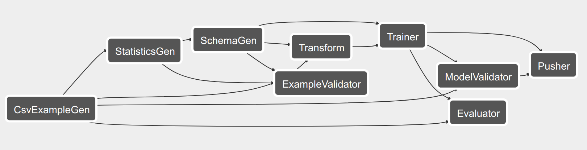

# Chicago Taxi Example

The Chicago Taxi example demonstrates the end-to-end workflow and steps of how
to analyze, validate and transform data, train a model, analyze and serve it. It
uses the following [TFX](https://www.tensorflow.org/tfx) components:

* [ExampleGen](https://github.com/tensorflow/tfx/blob/master/docs/guide/examplegen.md)
  ingests and splits the input dataset.
* [StatisticsGen](https://github.com/tensorflow/tfx/blob/master/docs/guide/statsgen.md)
  calculates statistics for the dataset.
* [SchemaGen](https://github.com/tensorflow/tfx/blob/master/docs/guide/schemagen.md)
  SchemaGen examines the statistics and creates a data schema.
* [ExampleValidator](https://github.com/tensorflow/tfx/blob/master/docs/guide/exampleval.md)
  looks for anomalies and missing values in the dataset.
* [Transform](https://github.com/tensorflow/tfx/blob/master/docs/guide/transform.md)
  performs feature engineering on the dataset.
* [Trainer](https://github.com/tensorflow/tfx/blob/master/docs/guide/trainer.md)
  trains the model using TensorFlow [Estimators](https://www.tensorflow.org/guide/estimators)
* [Evaluator](https://github.com/tensorflow/tfx/blob/master/docs/guide/evaluator.md)
  performs deep analysis of the training results.
* [ModelValidator](https://github.com/tensorflow/tfx/blob/master/docs/guide/modelval.md)
  ensures that the model is "good enough" to be pushed to production.
* [Pusher](https://github.com/tensorflow/tfx/blob/master/docs/guide/pusher.md)
  deploys the model to a serving infrastructure.

## The dataset

Explore the full dataset in the
[BigQuery UI](https://bigquery.cloud.google.com/dataset/bigquery-public-data:chicago_taxi_trips).

## Local prerequisites

* [Apache Airflow](https://airflow.apache.org/) is used for pipeline orchestration.
* [Apache Beam](https://beam.apache.org/) is used for distributed processing.
* [Docker](https://www.docker.com/) is used for containerization.
* [TensorFlow](https://tensorflow.org) is used for model training, evaluation and inference.

### Install dependencies

Configure common paths:

<pre class="devsite-terminal devsite-click-to-copy">
export AIRFLOW_HOME=/Users/laksh/siris/learning/chicago_taxi_pipeline_tfx/airflow
export TAXI_DIR=/Users/laksh/siris/learning/chicago_taxi_pipeline_tfx/taxi
export TFX_DIR=/Users/laksh/siris/learning/chicago_taxi_pipeline_tfx/tfx
</pre>

Next, install the dependencies required by the Chicago Taxi example:

<pre class="devsite-terminal devsite-click-to-copy">
pip install tensorflow==1.13.1
pip install docker==4.0.1
export SLUGIFY_USES_TEXT_UNIDECODE=yes
pip install apache-airflow==1.10.3
pip install tfx==0.13.0
</pre>

Next, initialize Airflow

<pre class="devsite-terminal devsite-click-to-copy">
airflow initdb
</pre>

### Copy the pipeline definition to Airflow's DAG directory

<pre class="devsite-terminal devsite-click-to-copy">
mkdir -p $TAXI_DIR/data/simple
cp data/simple/data.csv $TAXI_DIR/data/simple
</pre>

<pre class="devsite-terminal devsite-click-to-copy">
mkdir -p $AIRFLOW_HOME/dags/taxi
cp taxi_pipeline_simple.py $AIRFLOW_HOME/dags/taxi
</pre>

<pre class="devsite-terminal devsite-click-to-copy">
cp taxi_utils.py $TAXI_DIR
</pre>

## Run the local example

### Start Airflow

<pre class="devsite-terminal devsite-click-to-copy">
airflow webserver
</pre>

<pre class="devsite-terminal devsite-click-to-copy">
airflow scheduler
</pre>

Open a browser to <code>127.0.0.1:8080</code> and click on the <code>chicago_taxi_simple</code> example.
It should look like the image below if you click the Graph View option.

### Run the example

If you were looking at the graph above, click on the <code>DAGs</code> button to
get back to the DAGs view.

Enable the <code>chicago_taxi_simple</code> pipeline in Airflow by toggling
the DAG to <code>On</code>.  Now that it is schedulable, click on the
<code>Trigger DAG button</code> (triangle inside a circle) to start the run. You
can view status by clicking on the started job, found in the
<code>Last run</code> column. This process will take several minutes.

### Serve the TensorFlow model

Once the pipeline completes, the model will be copied by the [Pusher](https://github.com/tensorflow/tfx/blob/master/docs/guide/pusher.md)
to the directory configured in the example code:

<pre class="devsite-terminal devsite-click-to-copy">
ls $TAXI_DIR/serving_model/taxi_simple
</pre>

To serve the model with [TensorFlow Serving](https://www.tensorflow.org/serving)
please follow the instructions [here](https://github.com/tensorflow/tfx/blob/master/tfx/examples/chicago_taxi/README.md#serve-the-tensorflow-model) with following environment variables:

For start_model_server_local.sh:

<pre class="devsite-terminal devsite-click-to-copy">
LOCAL_MODEL_DIR=$TAXI_DIR/serving_model/taxi_simple \
start_model_server_local.sh
</pre>

This will pick up the latest model under above path.

For classify_local.sh:

<pre class="devsite-terminal devsite-click-to-copy">
EXAMPLES_FILE=~/taxi/data/simple/data.csv \
SCHEMA_FILE=~/tfx/pipelines/chicago_taxi_simple/SchemaGen/output/<b>CHANGE_TO_LATEST_DIR</b>/schema.pbtxt \
classify_local.sh
</pre>

# Chicago Taxi Flink Example (python 2.7 only, python 3 WIP)

Start local Flink cluster and Beam job server:

<pre class="devsite-terminal devsite-click-to-copy">
git clone https://github.com/tensorflow/tfx ~/tfx-source && pushd ~/tfx-source
sh tfx/examples/chicago_taxi/setup_beam_on_flink.sh
</pre>

Follow above instructions of Chicago Taxi Example with 'taxi_pipeline_simple'
replaced by 'taxi_pipeline_portable_beam'.
(Check http://localhost:8081 for the Flink Cluster Dashboard)

# Chicago Taxi Spark Example (python 2.7 only, python 3 WIP)

Start local Spark cluster and Beam job server:

<pre class="devsite-terminal devsite-click-to-copy">
git clone https://github.com/tensorflow/tfx ~/tfx-source && pushd ~/tfx-source
sh tfx/examples/chicago_taxi/setup_beam_on_spark.sh
</pre>

Follow above instructions of Chicago Taxi Example with 'taxi_pipeline_simple'
replaced by 'taxi_pipeline_portable_beam'.
(Check http://localhost:8081 for the Spark Cluster Dashboard)

# Learn more

Please see the [TFX User Guide](https://github.com/tensorflow/tfx/blob/master/docs/guide/index.md) to learn more.
